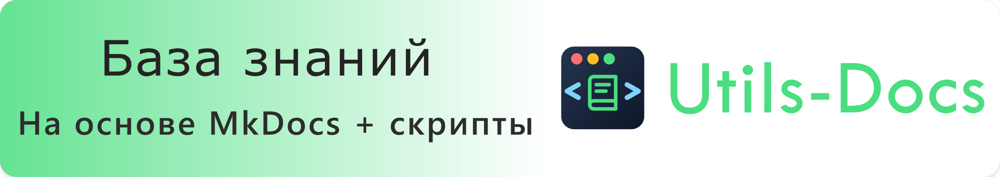
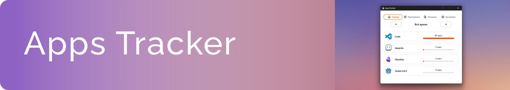
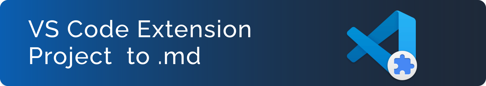
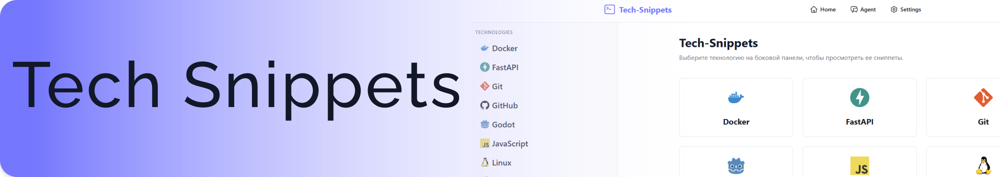
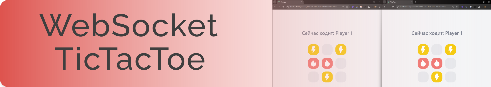
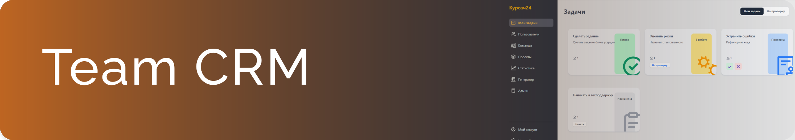

<h1 align="center">Привет, Меня зовут Михаил!</h1>

  

<h2 align="center">Обо мне:</h2>
  
Студент 4 курса по направлению "Информатика и вычислительная техника"

Моё основное направление — Backend-разработка, также активно изучаю другие области IT (такие как фронтенд, базы данных, DevOps). 

  
## Мои проекты:

<table>
  <tr>
    <td colspan="3" align="center">
      
    </td>
  </tr>
  <tr>
    <td width="40%" valign="top">
      CLI-инструмент для оценки качества докстрингов в Python-проектах с Rich-визуализацией. Сканирует локальные папки, Git-репозитории и PyPI-пакеты.
    </td>
    <td width="20%" valign="top">
      
      
      
      
    </td>
    <td width="40%" valign="top">
      
      
      
      
      
      
  </tr>
</table>
<table>
  <tr>
    <td colspan="3" align="center">
      
    </td>
  </tr>
  <tr>
    <td width="40%" valign="top">
      Self-hosted плагин для MkDocs Material. Автоматизация работы с базой знаний и непрерывная интеграция через GitHub Actions.
    </td>
    <td width="20%" valign="top">
      
      
    </td>
    <td width="40%" valign="top">
      
        
        
        
        
        
        
        
  </tr>
</table>

<table>
  <tr>
    <td colspan="3" align="center">
      
    </td>
  </tr>
  <tr>
    <td width="40%" valign="top">
      Десктопное приложения для отслеживания активности выбранных Windows приложений как процессов.
    </td>
    <td width="20%" valign="top">
      
    </td>
    <td width="40%" valign="top">
      
      
      
      
      
      
      
      
  </tr>
</table>

<table>
  <tr>
    <td colspan="3" align="center">
      
    </td>
  </tr>
  <tr>
    <td width="40%" valign="top">
      Расширение для VS Code для быстрой конвертации проекта в .md файл с учётом структуры папок.
    </td>
    <td width="20%" valign="top">
      
      
      
    </td>
    <td width="40%" valign="top">
      
      
      
  </tr>
</table>

<table>
  <tr>
    <td colspan="3" align="center">
      
    </td>
  </tr>
  <tr>
    <td width="40%" valign="top">
      Сервис для хранения сниппетов и часто используемых фрагментов кода.
    </td>
    <td width="20%" valign="top">
      
    </td>
    <td width="40%" valign="top">
      
      
      
      
      
      
      
      
      
      
  </tr>
</table>

<table>
  <tr>
    <td colspan="3" align="center">
      
    </td>
  </tr>
  <tr>
    <td width="40%" valign="top">
      Платформа на Веб-сокетах для игры в крестики-нолики для двоих игроков и поддерджкой лобби.
    </td>
    <td width="20%" valign="top">
      
    </td>
    <td width="40%" valign="top">
      
      
      
      
      
      
  </tr>
</table>

<table>
  <tr>
    <td colspan="3" align="center">
      
    </td>
  </tr>
  <tr>
    <td width="40%" valign="top">
      Корпоративная CRM система для управления проектами и задачами с поддержкой ролей пользователей. Разработано в качестве курсовой работы.
    </td>
    <td width="20%" valign="top">
      
    </td>
    <td width="40%" valign="top">
      
      
      
      
      
      
      
      
      
  </tr>
</table>

## Технологии с которыми я работаю:

### Языки программирования:

### Фреймворки:

### Базы данных:

### DevOps:

<table>
  <tr>
    <td></td>
    <td></td>
  </tr>
</table>

